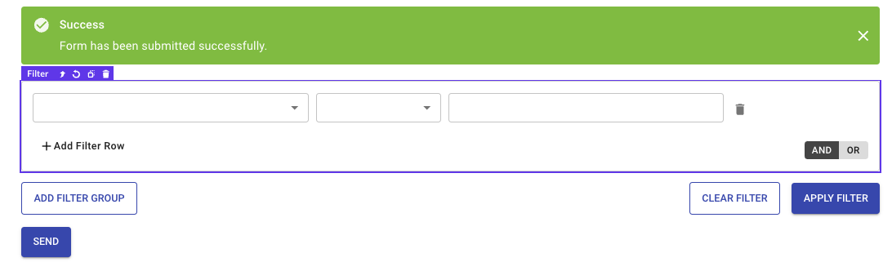
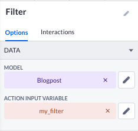
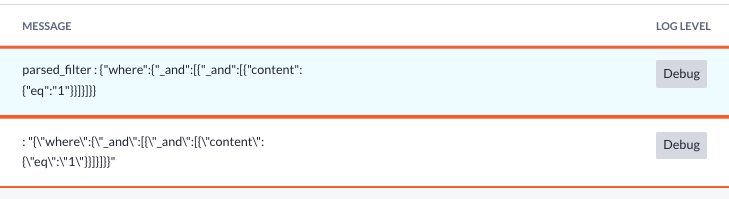

# Custom Filter Component

The Custom Filter Component helps you filter a datatable or datalist based on specific properties and relational data. You can use up to 6 levels of relational filtering.

## Property Whitelist & Blacklist

The whitelist is a feature that lets you choose which properties should be shown on the left-hand side (LHS) of the filter. This includes both direct properties and properties from related data.

How to use the whitelist

1. Go to the Property Whitelist section in the component options.
2. Enter the properties you want to see in the LHS field and separate them with a comma (,).

The properties you enter should have the same format as the dataAPI (camelCase). If you are not sure about the format or name of the property, you can check the `DATABASE NAME` column in the model viewer. Replace each character after the underscore (_) with a capital letter and remove the underscore. So, for example: if the property is `my_property_name`, it becomes `myPropertyName`.

### Relational whitelisting

If you want to include properties from related data, follow this format:
Let's say we have a model called `shoppingCart` and`shoppingCart` **has many** `shopItems`. To include the properties of `shopItems` in the whitelist, use the following format:
`shopItems.name`

### Property Blacklist

The blacklist is the exact opposite of the whitelist. It allows you to specify which properties should not be shown on the LHS of the filter.

## Using the filter in your actions

Occassionally you wish to use the filter that the user has defined in your actions. For example, when exporting filtered data. Here's how to do it:
1. Drop a form on your page if not already present.
2. Place the Custom Filter Component in the form. A Action Variable picker should display in the options panel of the component.

3. Select/Create an action variable.

4. To use the filter, you still have to parse it using the block `Parse JSON` which can be found [here](https://my.bettyblocks.com/block-store/0e2b5a6c-24ae-4f7f-9d07-10ab64c9155c).
5. You can now use the filter in your actions! 

## Feature Requests

You can create feature requests in the Issues section of the original repository, which can be found [here](https://github.com/Betty-Services/CustomFilter/issues)

## Contributing

Everybody can contribute to this component. If you wish to help maintain this project, please do so by creating a pull request. 
